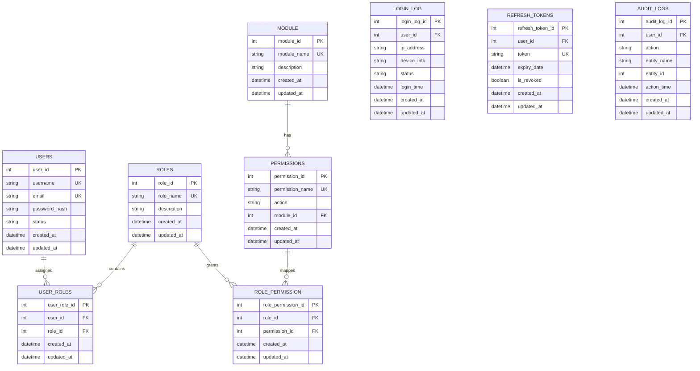

```mermaid
erDiagram

    USERS {
        int user_id PK
        string username UK
        string email UK
        string password_hash
        string status
        datetime created_at
        datetime updated_at
    }

    ROLES {
        int role_id PK
        string role_name UK
        string description
        datetime created_at
        datetime updated_at
    }

    MODULE {
        int module_id PK
        string module_name UK
        string description
        datetime created_at
        datetime updated_at
    }

    PERMISSIONS {
        int permission_id PK
        string permission_name UK
        string action
        int module_id FK
        datetime created_at
        datetime updated_at
    }

    ROLE_PERMISSION {
        int role_permission_id PK
        int role_id FK
        int permission_id FK
        datetime created_at
        datetime updated_at
    }

    USER_ROLES {
        int user_role_id PK
        int user_id FK
        int role_id FK
        datetime created_at
        datetime updated_at
    }

    LOGIN_LOG {
        int login_log_id PK
        int user_id FK
        string ip_address
        string device_info
        string status
        datetime login_time
        datetime created_at
        datetime updated_at
    }

    REFRESH_TOKENS {
        int refresh_token_id PK
        int user_id FK
        string token UK
        datetime expiry_date
        boolean is_revoked
        datetime created_at
        datetime updated_at
    }

    AUDIT_LOGS {
        int audit_log_id PK
        int user_id FK
        string action
        string entity_name
        int entity_id
        datetime action_time
        datetime created_at
        datetime updated_at
    }

    USERS ||--o{ USER_ROLES : assigned
    ROLES ||--o{ USER_ROLES : contains

    ROLES ||--o{ ROLE_PERMISSION : grants
    PERMISSIONS ||--o{ ROLE_PERMISSION : mapped

    MODULE ||--o{ PERMISSIONS : has
```
    USERS ||--o{ LOGIN_LOG : generates
    USERS ||--o{ REFRESH_TOKENS : owns
    USERS ||--o{ AUDIT_LOGS : performs
